# NLP Analyzer Architecture Explained for Software Developers

## Overview: What is spaCy and Why This Architecture?

**spaCy** is an industrial-strength Natural Language Processing (NLP) library that processes text and extracts linguistic information like:

- **Tokens**: Individual words/punctuation
- **POS Tags**: Part-of-speech (noun, verb, adjective, etc.)
- **Dependencies**: Grammatical relationships between words
- **Entities**: Named entities (people, places, organizations)
- **Semantic Vectors**: Mathematical representations of word meanings

Our NLP analyzer uses spaCy to intelligently parse search queries and extract:

- **Main Objective**: What the user is primarily looking for.
- **Attributes**: Descriptive properties (colors, sizes, materials, modifiers, etc.).
- **Sub-objectives**: Secondary items of interest (now minimized in favor of richer attribute classification).

## System Architecture Overview

The architecture is designed around a configuration-driven, multi-layered analysis pipeline that leverages spaCy's linguistic intelligence to handle complex and ambiguous queries.

```mermaid
graph TD
    Input["User Query: 'christmas tree decoration'"]

    subgraph Core ["Core Components"]
        CM["ConfigManager"]
        NLP["NLPAnalyzer"]
        SM["spaCy Model (en_core_web_lg)"]
    end

    subgraph Pipeline ["Analysis Pipeline"]
        OE["ObjectiveExtractor"]
        AM["AttributeManager"]
        MLC["🧠 MultiLayerClassifier"]
    end

    subgraph Layers ["MultiLayerClassifier Layers"]
        POSL["1. POS-Aware Layer (e.g., 'painting' VERB vs. NOUN)"]
        ECL["2. Entity Correction Layer (Fixes color misclassifications)"]
        CDL["3. Compound Detection Layer (Handles 'christmas tree')"]
        CFL["4. Context Fallback Layer (Uses surrounding words)"]
    end

    subgraph Output ["Output"]
        Result["Analysis Result JSON"]
    end

    Input --> NLP
    CM --> NLP
    NLP --> SM

    SM --> OE
    SM --> AM

    AM <--> OE

    AM --> MLC
    MLC --> POSL
    MLC --> ECL
    MLC --> CDL
    MLC --> CFL

    OE --> Result
    AM --> Result
```



## Data Flow: From Query to Results

The data flow is now centered around the Multi-Layer Classifier, which provides robust, context-aware attribute identification before the final objectives are assigned.


## Key spaCy Concepts for Developers

### 1. Document Processing

```python
# When you do: doc = nlp("large red leather handbag")
# spaCy creates a Doc object containing:

doc[0]  # Token: "large"
doc[0].text      # "large"
doc[0].pos_      # "ADJ" (adjective)
doc[0].dep_      # "amod" (adjectival modifier)
doc[0].head      # Points to "handbag" (what it modifies)
doc[0].has_vector # True (has semantic vector)
```

### 2. Token Attributes Used in Our System

```python
for token in doc:
    token.text       # Raw text: "large"
    token.lemma_     # Base form: "large"
    token.pos_       # Part of speech: "ADJ"
    token.dep_       # Dependency relation: "amod"
    token.tag_       # Fine-grained POS: "JJ"
    token.ent_type_  # Entity type: "PERSON", "ORG", etc.
    token.is_alpha   # Is alphabetic: True
    token.is_stop    # Is stop word: False
    token.similarity(other_token)  # Semantic similarity score
```

### 3. Dependency Parsing

In "christmas tree decoration", spaCy identifies a compound chain: `christmas -> tree -> decoration`.


Our system intelligently analyzes this chain to determine the true main objective.

## Core Components Deep Dive

### 1. ConfigManager

```python
class ConfigManager:
    # Loads configuration from config.json
    # Contains thresholds, prototypes, scoring parameters, and heuristic word lists
    # Validates configuration integrity
```

**Purpose**: Centralized configuration management without hardcoded values. All heuristics and parameters are tunable.

### 2. ObjectiveExtractor

```python
class ObjectiveExtractor:
    def extract_objectives(self, doc):
        # 1. Find all potential content candidates (nouns, proper nouns).
        # 2. Use the AttributeManager and its MultiLayerClassifier to pre-classify tokens.
        # 3. Calculate an importance score for each candidate.
        # 4. Select the main objective based on score and context.
```

**Importance Scoring (Conceptual)**:
The scoring is no longer a simple sum of boosts and penalties. It's a nuanced algorithm that prioritizes tokens based on:

- **Grammatical Role**: `ROOT` tokens are important, but not always the main objective.
- **Descriptive Power**: In a compound chain like "christmas tree", the descriptive identifier ("christmas") is given a higher score than the generic head noun ("tree").
- **Subject vs. Format**: The system differentiates between subject matter ("dog") and format descriptors ("sketch"). In art queries, the subject is usually preferred as the main objective.
- **Semantic Context**: A token's score is influenced by its relationship to other words in the query.

### 3. AttributeManager & Multi-Layer Classifier (The Brains of the Operation)

The `AttributeManager` now orchestrates a powerful `MultiLayerClassifier` to ensure attributes are identified accurately and contextually.

```python
class AttributeManager:
    def __init__(self):
        # Initializes base detectors (Color, Semantic)
        # Initializes the MultiLayerClassifier
        self.multi_layer_classifier = MultiLayerClassifier(...)

class MultiLayerClassifier:
    def __init__(self):
        self.pos_aware_layer = POSAwareClassifier(...)
        self.entity_correction_layer = EntityCorrectionLayer(...)
        self.compound_detection_layer = CompoundDetectionLayer(...)
        self.context_fallback_layer = ContextFallbackLayer(...)

    def classify_token(self, token, doc):
        # Passes token through each layer until a confident classification is found.
```

## Attribute Detection Pipeline (New)

The system uses a multi-layered pipeline, where each layer solves a specific type of ambiguity.

```mermaid
flowchart TD
    Token["Token (e.g., 'tree', 'painting')"]

    Token --> L1["🧠 1. POS-Aware Layer"]
    L1 -->|Is it painting?| L1_Check{"Check if VERB or NOUN"}
    L1_Check -->|"It's a NOUN"| L1_Result["✅ Classify as format_type"]
    L1_Check -->|Not painting or Unsure| L2["🧠 2. Entity Correction Layer"]

    L2 -->|Is it misclassified color?| L2_Result["✅ Classify as color"]
    L2 -->|Unsure| L3["🧠 3. Compound Detection Layer"]

    L3 -->|Is token tree in christmas tree?| L3_Check{"Analyze compound structure"}
    L3_Check --> L3_Result["✅ Classify as modifier (attribute)"]
    L3 -->|Unsure| L4["🧠 4. Context Fallback Layer"]

    L4 -->|Analyze surrounding words| L4_Result["✅ Best guess based on context"]

    subgraph Layers
        L1
        L2
        L3
        L4
    end

    L4_Result --> Final["Final Classification"]
```



**Pipeline Stages & Purpose:**

1.  **🧠 POS-Aware Layer**: Handles words whose meaning depends on their part of speech.
    - _Example_: Classifies "painting" as an action (verb) or a format type (noun) based on its grammatical role.
2.  **🧠 Entity Correction Layer**: Fixes common spaCy entity misclassifications.
    - _Example_: Correctly identifies "red" or "blue" as colors, even if spaCy mistakenly tags them as organizations.
3.  **🧠 Compound Detection Layer**: The key to understanding compound subjects. It analyzes relationships within compound nouns.
    - _Example_: In "christmas tree", it recognizes that "tree" is a modifier describing the main concept, "christmas". It also ensures "tree" is treated as an attribute, not a sub-objective.
4.  **🧠 Context Fallback Layer**: A safety net that uses the semantic vectors of surrounding words to make an educated guess when other layers are uncertain.

## Semantic Similarity Explained

### What are Word Vectors?

```python
# Each word is represented as a 300-dimensional vector
word_vector = nlp("large")[0].vector  # numpy array of 300 floats
# Similar words have similar vectors

# Similarity calculation
large_token = nlp("large")[0]
big_token = nlp("big")[0]
similarity = large_token.similarity(big_token)  # ~0.85 (very similar)

huge_token = nlp("huge")[0]
similarity2 = large_token.similarity(huge_token)  # ~0.75 (similar)

red_token = nlp("red")[0]
similarity3 = large_token.similarity(red_token)  # ~0.15 (not similar)
```

### Prototype-Based Detection

This is still used within the classification layers but with more contextual checks.

```python
class SemanticAttributeDetector:
    def __init__(self, prototypes=["large", "big", "small", "tiny"]):
        self.prototypes = prototypes

    def detect(self, token):
        max_similarity = 0.0
        for prototype in self.prototypes:
            prototype_token = nlp(prototype)[0]
            similarity = token.similarity(prototype_token)
            max_similarity = max(max_similarity, similarity)

        return max_similarity > threshold
```

## Example: Complete Processing Flow (New)

### Input: "christmas tree decoration"

#### Step 1: spaCy Processing

```python
doc = nlp("christmas tree decoration")
# Creates tokens and dependency chain: christmas -> tree -> decoration (ROOT)
```

#### Step 2: Candidate Analysis & Scoring (`ObjectiveExtractor`)

1.  **Candidates**: `christmas`, `tree`, `decoration`.
2.  **Attribute Pre-classification (`MultiLayerClassifier`)**:
    - `decoration`: Identified as `format_types` with high confidence.
    - `tree`: Passed to `CompoundDetectionLayer`. Since it's part of the "christmas tree" compound driven by a descriptive identifier, it's classified as a `modifier` attribute.
3.  **Importance Scoring**:
    - `christmas`: `PROPN` (proper noun) and a descriptive identifier for the head `tree`. It receives a very high importance score, higher than the grammatical `ROOT`.
    - `tree`: Is an attribute (`modifier`), so its importance score for being a main objective is penalized.
    - `decoration`: Is an attribute (`format_type`), also penalized.
4.  **Objective Selection**: `christmas` has the highest score and becomes the `main_objective`.

#### Step 3: Final Attribute Categorization (`AttributeManager`)

- The system iterates through the non-objective tokens.
- `tree`: Already classified as a `modifier`.
- `decoration`: Already classified as a `format_type`.

#### Step 4: Final Result

```json
{
  "query": "christmas tree decoration",
  "main_objective": "christmas",
  "sub_objectives": [],
  "attributes": {
    "modifiers": ["tree"],
    "format_types": ["decoration"]
  }
}
```

## Configuration-Driven Approach

### Why Configuration?

- **Flexibility**: Adjust thresholds and behavior without code changes.
- **Maintainability**: Clear separation of logic and parameters.
- **Tuning**: Easy to optimize for different domains by modifying the JSON file.

### Sample `config.json` (Updated)

Note the new lists for heuristic checks, which were previously hardcoded.

```json
{
  "size_threshold": 0.6,
  "material_threshold": 0.65,
  "size_prototypes": ["small", "large", "tiny", "huge"],
  "material_prototypes": ["wood", "metal", "plastic", "leather"],

  "importance_threshold_sub_objectives": 3,
  "subject_object_boost": 2,

  "time_event_indicators": ["christmas", "birthday", "wedding", "holiday"],
  "object_context_indicators": [
    "decoration",
    "ornament",
    "design",
    "art",
    "gift",
    "toy"
  ],
  "technique_indicators": ["technique", "method", "style", "approach", "way"],
  "abstract_suffixes": ["tion", "sion", "ness", "ment", "ity", "ism"],

  "multi_layer_classification": {
    "semantic_confidence_threshold": 0.7,
    "contextual_similarity_high": 0.8
  }
}
```

## Performance Considerations

### 1. Model Caching

```python
@lru_cache(maxsize=1)
def _load_spacy_model(self):
    return spacy.load("en_core_web_lg")  # Loaded once, cached
```

### 2. Vector Availability

```python
if token.has_vector:  # Check before similarity calculation
    similarity = token.similarity(prototype)
```

### 3. Fallback Strategy

```python
try:
    return spacy.load("en_core_web_lg")    # Best model
except OSError:
    return spacy.load("en_core_web_sm")    # Fallback
```

## Testing and Validation

The testing approach remains the same, with `test_fixes.py` providing integration tests for the full analysis pipeline.

```python
def test_christmas_query():
    analyzer = NLPAnalyzer()
    result = analyzer.analyze_query("christmas tree decoration")

    assert result["main_objective"] == "christmas"
    assert "tree" in result["attributes"]["modifiers"]
    assert "decoration" in result["attributes"]["format_types"]
    assert not result["sub_objectives"]
```

## Error Handling & Extensibility

The system's core principles of graceful error handling and extensibility remain. Adding a new attribute type would now likely involve enhancing one of the classifier layers or adding a new one to the `MultiLayerClassifier` pipeline, in addition to registering any new semantic prototypes in the configuration.

This architecture provides a highly robust, extensible, and context-aware foundation for query understanding.
