# NLP Analyzer Architecture Explained for Software Developers

## Overview: What is spaCy and Why This Architecture?

**spaCy** is an industrial-strength Natural Language Processing (NLP) library that processes text and extracts linguistic information like:

- **Tokens**: Individual words/punctuation
- **POS Tags**: Part-of-speech (noun, verb, adjective, etc.)
- **Dependencies**: Grammatical relationships between words
- **Entities**: Named entities (people, places, organizations)
- **Semantic Vectors**: Mathematical representations of word meanings

Our NLP analyzer uses spaCy to intelligently parse search queries and extract:

- **Main Objective**: What the user is primarily looking for
- **Sub-objectives**: Secondary items of interest
- **Attributes**: Descriptive properties (colors, sizes, materials, etc.)

## System Architecture Overview

```mermaid
graph TB
    Input["User Query: large red leather handbag"]

    subgraph Core ["Core Components"]
        CM["ConfigManager"]
        NLP["NLPAnalyzer"]
        SM["spaCy Model"]
    end

    subgraph Pipeline ["Analysis Pipeline"]
        OE["ObjectiveExtractor"]
        AM["AttributeManager"]
        CME["CompoundModifierExtractor"]
    end

        subgraph Detection ["Attribute Detection"]
        CD["🎨 ColorDetector (WebColors API)"]

        subgraph Semantic ["Semantic Detectors"]
            SizeD["📏 SizeDetector (large, small, tiny, huge)"]
            MaterialD["🧱 MaterialDetector (wood, metal, leather, fabric)"]
            ShapeD["🔵 ShapeDetector (round, square, oval, curved)"]
            FormatD["📄 FormatDetector (digital, print, sketch, photo)"]
        end
    end

    subgraph Output ["Output"]
        Result["Analysis Result JSON"]
    end

    Input --> NLP
    CM --> NLP
    NLP --> SM
    SM --> OE
    SM --> AM
    AM --> CD
    AM --> SizeD
    AM --> MaterialD
    AM --> ShapeD
    AM --> FormatD
    OE --> CME
    OE --> Result
    AM --> Result
```



## Data Flow: From Query to Results


## Key spaCy Concepts for Developers

### 1. Document Processing

```python
# When you do: doc = nlp("large red leather handbag")
# spaCy creates a Doc object containing:

doc[0]  # Token: "large"
doc[0].text      # "large"
doc[0].pos_      # "ADJ" (adjective)
doc[0].dep_      # "amod" (adjectival modifier)
doc[0].head      # Points to "handbag" (what it modifies)
doc[0].has_vector # True (has semantic vector)
```

### 2. Token Attributes Used in Our System

```python
for token in doc:
    token.text       # Raw text: "large"
    token.lemma_     # Base form: "large"
    token.pos_       # Part of speech: "ADJ"
    token.dep_       # Dependency relation: "amod"
    token.tag_       # Fine-grained POS: "JJ"
    token.ent_type_  # Entity type: "PERSON", "ORG", etc.
    token.is_alpha   # Is alphabetic: True
    token.is_stop    # Is stop word: False
    token.similarity(other_token)  # Semantic similarity score
```

### 3. Dependency Parsing


## Core Components Deep Dive

### 1. ConfigManager

```python
class ConfigManager:
    # Loads configuration from config.json
    # Contains thresholds, prototypes, scoring parameters
    # Validates configuration integrity
```

**Purpose**: Centralized configuration management without hardcoded values.

### 2. ObjectiveExtractor

```python
class ObjectiveExtractor:
    def extract_objectives(self, doc):
        # 1. Find compound modifiers ("hand drawn", "oil painted")
        # 2. Score tokens by grammatical importance
        # 3. Select highest-scoring non-attribute as main objective
        # 4. Select other significant tokens as sub-objectives
```

**Scoring Algorithm**:

- **+7**: Subject/Object dependency relations (subject_object_boost + 5)
- **+1**: Root of dependency tree (root_boost)
- **+3**: Concrete nouns (concrete_noun_boost + 2)
- **+3**: Has adjective modifiers (adjective_modifier_boost + 2)
- **-8**: Is a named entity (should be attribute)
- **-10**: Is detected as attribute

### 3. AttributeManager

```python
class AttributeManager:
    def __init__(self):
        self.detectors = [
            ColorDetector(),                    # 🎨 Uses WebColors library
            SizeDetector(),                     # 📏 Semantic similarity for sizes
            MaterialDetector(),                 # 🧱 Semantic similarity for materials
            ShapeDetector(),                    # 🔵 Semantic similarity for shapes
            FormatDetector()                    # 📄 Semantic similarity for formats
        ]

# Note: SizeDetector, MaterialDetector, etc. are conceptual names for clarity.
# In the actual implementation, these are all instances of SemanticAttributeDetector
# configured with different prototypes and thresholds.
```

**Detection Strategy**:

- **🎨 Colors**: Exact match against CSS3/CSS2 color names (WebColors API)
- **📏 Sizes**: Semantic similarity to prototypes (large, small, tiny, huge...)
- **🧱 Materials**: Semantic similarity to prototypes (wood, metal, leather, fabric...)
- **🔵 Shapes**: Semantic similarity to prototypes (round, square, oval, curved...)
- **📄 Formats**: Semantic similarity to prototypes (digital, print, sketch, photo...)
- **Fallback**: POS-based classification for unmatched attributes

### 4. Attribute Detection Pipeline

The system processes each token through a tiered detection strategy:

```mermaid
flowchart TD
    Token["Token: crimson"]

    subgraph ColorDetection ["🎨 Color Detection"]
        WC["WebColors Lookup"]
        CSS3{"CSS3 Color?"}
        CSS2{"CSS2 Color?"}
    end

    subgraph SemanticDetection ["📏 Semantic Detection"]
        Vector{"Has Vector?"}
        Similarity["Compare to Prototypes"]
        Threshold{"Above Threshold?"}
    end

    subgraph POSFallback ["📝 POS Fallback"]
        POS["Check POS Tag"]
        Classify["Classify by Grammar"]
    end

    Token --> WC
    WC --> CSS3
    CSS3 -->|Yes| ColorMatch["✅ Color: confidence=1.0"]
    CSS3 -->|No| CSS2
    CSS2 -->|Yes| ColorMatch2["✅ Color: confidence=0.95"]
    CSS2 -->|No| Vector

    Vector -->|Yes| Similarity
    Vector -->|No| POS
    Similarity --> Threshold
    Threshold -->|Yes| SemanticMatch["✅ Semantic Match"]
    Threshold -->|No| POS

    POS --> Classify
    Classify --> POSMatch["✅ POS-based Classification"]
```



**Pipeline Stages:**

1. **🎨 Color Detection (Highest Priority)**: Uses WebColors API for exact color matching
2. **📏 Semantic Detection**: Compares word vectors against prototype vocabularies
3. **📝 POS Fallback**: Uses grammatical classification when other methods fail

**Example Flow:**

- `"crimson"` → WebColors finds CSS3 match → ✅ Color (confidence=1.0)
- `"large"` → No color match → Has vector → Similarity to size prototypes → ✅ Size (confidence=0.8)
- `"old"` → No color match → No semantic match → POS=ADJ → ✅ Adjective

## Semantic Similarity Explained

### What are Word Vectors?

```python
# Each word is represented as a 300-dimensional vector
word_vector = nlp("large")[0].vector  # numpy array of 300 floats
# Similar words have similar vectors

# Similarity calculation
large_token = nlp("large")[0]
big_token = nlp("big")[0]
similarity = large_token.similarity(big_token)  # ~0.85 (very similar)

huge_token = nlp("huge")[0]
similarity2 = large_token.similarity(huge_token)  # ~0.75 (similar)

red_token = nlp("red")[0]
similarity3 = large_token.similarity(red_token)  # ~0.15 (not similar)
```

### Prototype-Based Detection

```python
class SemanticAttributeDetector:
    def __init__(self, prototypes=["large", "big", "small", "tiny"]):
        self.prototypes = prototypes

    def detect(self, token):
        max_similarity = 0.0
        for prototype in self.prototypes:
            prototype_token = nlp(prototype)[0]
            similarity = token.similarity(prototype_token)
            max_similarity = max(max_similarity, similarity)

        return max_similarity > threshold
```

## Example: Complete Processing Flow

### Input: "Show me large red leather handbags"

#### Step 1: spaCy Processing

```python
doc = nlp("Show me large red leather handbags")
# Creates tokens with linguistic annotations
```

#### Step 2: Token Analysis

```
Token    | POS  | Dep     | Head     | Analysis
---------|------|---------|----------|----------
Show     | VERB | ROOT    | Show     | Action verb (skip)
me       | PRON | iobj    | Show     | Pronoun (skip)
large    | ADJ  | amod    | handbags | Adjective modifier
red      | ADJ  | amod    | handbags | Adjective modifier
leather  | NOUN | compound| handbags | Compound noun
handbags | NOUN | dobj    | Show     | Direct object
```

#### Step 3: Objective Extraction

```python
# Scoring:
# "handbags": base(1) + subject_object_boost(2) + 5 + concrete_noun(3) = 11
# "leather": base(1) + compound_penalty(1) = 2
# "large": base(1) - attribute_penalty(-10) = -9
# "red": base(1) - attribute_penalty(-10) = -9

# Result: main_objective = "handbags"
```

#### Step 4: Attribute Detection

```python
# "large" -> SemanticAttributeDetector finds similarity to size prototypes
# "red" -> ColorDetector finds exact CSS color match
# "leather" -> SemanticAttributeDetector finds similarity to material prototypes
```

#### Step 5: Final Result

```json
{
  "query": "Show me large red leather handbags",
  "main_objective": "handbags",
  "sub_objectives": [],
  "attributes": {
    "colors": ["red"],
    "sizes": ["large"],
    "materials": ["leather"]
  }
}
```

## Advanced Features

### 1. Compound Modifier Detection

```python
# Input: "hand drawn illustration"
# Detects: "hand drawn" as compound modifier
# Pattern: NOUN + PAST_PARTICIPLE with artistic context
```

### 2. Entity Handling

```python
# spaCy identifies: "Van Gogh" as PERSON entity
# Our system: Keeps as entity, doesn't make it main objective
```

### 3. Importance Scoring

```python
def calculate_importance_score(token):
    score = base_importance_score  # 1 from config
    if token.dep_ in subject_object_deps:  # Subject/Object
        score += subject_object_boost + 5  # 2 + 5 = 7
    if token.dep_ == "ROOT":               # Root of sentence
        score += root_boost                # 1 from config
    if is_attribute(token):                # Detected attribute
        score -= 10                        # Heavy penalty
    return score
```

## Configuration-Driven Approach

### Why Configuration?

- **Flexibility**: Adjust thresholds without code changes
- **Maintainability**: Clear separation of logic and parameters
- **Tuning**: Easy to optimize for different domains

### Sample config.json

```json
{
  "color_threshold": 0.5,
  "size_threshold": 0.6,
  "material_threshold": 0.65,
  "size_prototypes": [
    "small",
    "large",
    "tiny",
    "huge",
    "medium",
    "big",
    "little",
    "enormous"
  ],
  "material_prototypes": [
    "wood",
    "metal",
    "plastic",
    "glass",
    "ceramic",
    "fabric",
    "leather"
  ],
  "importance_threshold_sub_objectives": 3,
  "entity_boost": 2,
  "subject_object_boost": 2
}
```

## Performance Considerations

### 1. Model Caching

```python
@lru_cache(maxsize=1)
def _load_spacy_model(self):
    return spacy.load("en_core_web_lg")  # Loaded once, cached
```

### 2. Vector Availability

```python
if token.has_vector:  # Check before similarity calculation
    similarity = token.similarity(prototype)
```

### 3. Fallback Strategy

```python
try:
    return spacy.load("en_core_web_lg")    # Best model
except OSError:
    return spacy.load("en_core_web_sm")    # Fallback
```

## Testing and Validation

### Unit Testing Approach

```python
def test_color_detection():
    detector = ColorDetector(nlp, config)

    # Test exact matches
    assert detector.detect("red")[0] == True
    assert detector.detect("crimson")[0] == True

    # Test non-colors
    assert detector.detect("large")[0] == False
```

### Integration Testing

```python
def test_full_analysis():
    analyzer = NLPAnalyzer()
    result = analyzer.analyze_query("large red leather handbag")

    assert result["main_objective"] == "handbag"
    assert "red" in result["attributes"]["colors"]
    assert "large" in result["attributes"]["sizes"]
```

## Error Handling

### Graceful Degradation

```python
try:
    webcolors.name_to_hex(color, spec=webcolors.CSS3)
    return True, 1.0
except ValueError:
    try:
        webcolors.name_to_hex(color, spec=webcolors.CSS2)
        return True, 0.95
    except ValueError:
        return False, 0.0  # Graceful failure
```

### Configuration Validation

```python
def __post_init__(self):
    for field_name in ["size_prototypes", "material_prototypes"]:
        if not isinstance(getattr(self, field_name), list):
            raise ValueError(f"{field_name} must be a list")
```

## Extending the System

### Adding New Attribute Types

```python
class BrandDetector(AttributeDetector):              # 🏷️ Custom brand detection
    def detect(self, token):
        # Custom brand detection logic (e.g., Nike, Apple, Samsung...)
        return is_brand, confidence

    def get_category_name(self):
        return "brands"

# Register in AttributeManager
detectors.append(BrandDetector(self.nlp, self.config))
```

### Custom Scoring Rules

```python
# In config.json
{
  "custom_boost_rules": {
    "brand_boost": 3,
    "technical_spec_boost": 2
  }
}
```

This architecture provides a robust, extensible foundation for query understanding that can be easily adapted to different domains and requirements.
